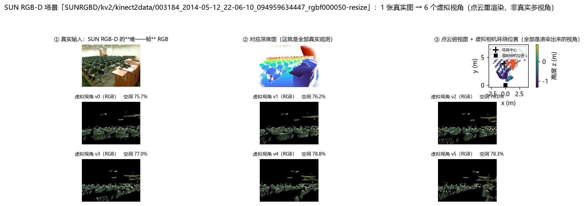
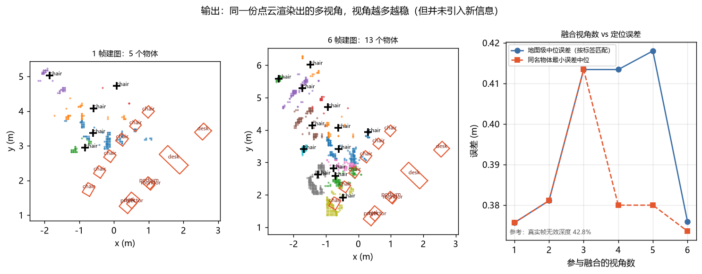

# 多视角数据核查报告

> ## ⚠️ 先说清楚：这份文档是**历史记录**（2026-09-13 补记）
>
> 本文核查并否定的那条链路 —— **单帧点云重渲染造"虚拟视角"** —— 已经**整体删除**：
>
> - 代码 `src/roboground/data/virtual_camera.py`：**已删除**（`look_at_pose()` 移到了
>   `src/roboground/geometry/camera.py`）；
> - 脚本 `scripts/26_visualize_multiview.py`、`scripts/27_ablate_multiview_real.py`：**已删除**；
> - 命令行选项 `--source virtual`（`scripts/03_build_map.py` / `scripts/05_benchmark.py`）：**已移除**；
> - 文中引用的两张图 `figures/multiview_real.png`、`figures/multiview_output.png`：**已删除**；
> - 本文引用的产物 `runs/bench_virtual.json`、`runs/map_virtual.*`：**已不在仓库里**
>   （只剩 `runs/ablation_multiview.json` 与两张 `runs/vis_multiview_*.png`），
>   所以下面这些数字**现在大多不可复现**，只作为"当时为什么这么判"的证据保留。
>   —— 例外：§3.4 / §3.5 的逐场景与配对检验数字仍能从 `runs/ablation_multiview.json`
>   逐条核对（`summary` / `verdict` / `per_scene` 三段），只是**重跑出它的脚本 27 已删**。
>
> **所以：下文所有命令都跑不了了，文中的数字只作历史记录，不要再引用。**
> 结论本身仍然有效（"重渲染不增加信息" / "−52% 已作废"），
> **替换后的做法**与它的实测证据见 **`docs/多视角全景融合报告.md`**
> （2D-3D-S 真实多视角 → 一张 360° 全景，与官方全景逐像素比对）。
>
> 按本项目的规矩：**历史记录不删、不美化** —— 这份文档正是"发现自己错了并量化代价"的样本。

> **这份文档是一次「自我核查」的记录**：项目文档里长期写着
> 「真实单帧 0.553 m → 多视角 0.262 m（−52%）」，
> 我怀疑这个说法有问题，于是从代码、数据、实验三个层面查了一遍。
> **结论是：那个说法站不住，已按实测更正。**
>
> 核查日期：2026-09-13 ｜ 复现命令全部在文中

---

## 一、先回答两个直接的问题

### 问题 1：视频用的是哪个数据集？

| 用途 | 数据集 | 规模 |
|---|---|---|
| **3D 场景理解 / 建图 / 查询**（S1–S3） | **SUN RGB-D** | 10,335 个场景（每个场景**一张** RGB-D） |
| **视频管线 / 语料工程**（S5） | **MSR-VTT** | 2,990 条真实视频 / 59,800 条字幕 / 1,232,868 帧 |
| 合成验证 | 自建 `SyntheticRoom` | 任意视角、任意物体数 |

### 问题 2：我们有"同一时刻 4 个视角"的数据吗？

**没有。**

SUN RGB-D 里**每个场景只有一张 RGB-D 图**。代码里其实早就写明了这一点
（`scripts/03_build_map.py` 第 8–9 行）：

> `--source virtual`：把 SUN RGB-D 场景的点云用**虚拟相机**重渲染成多视角序列，
> 用来验证"多视角融合"这条链路（**因为原始数据每个场景只有一帧**）

实测证据（磁盘上直接数）：

```
G:\Embodied3D\data\processed\*.npz   共 10,335 个文件
单个文件内容: rgb (224,224,3)  pc (50000,6)  box (N,7)  label (N,)  intrinsics (4,)  Rtilt
             ← 一张 RGB、一份点云、一组 GT 框 = 一个视点
```

而真正跑数据的入口 `load_sunrgbd_scene` 读的是**原始 SUN RGB-D 图片**
（`G:\sunrgbd_raw`）+ 官方 `SUNRGBDMeta.mat` 元数据，
那个 224×224 的 npz 属于另一个项目（Embodied3D），本项目只在 `roboground check`
里检查它是否存在（可选）。

**所以所谓"多视角"是这样造出来的**（`src/roboground/data/virtual_camera.py`）：

```
1 张真实 RGB-D ──► 反投影成点云（≤12 万点）──► 绕 GT 中心架 6 个虚拟相机
                                                  （半径 1.8 m，±25° 环绕）
                                             ──► splatting + z-buffer 重渲染
                                                  ──► 6 个"视角"
```

**6 个视角全部是渲染出来的**，其中**没有一个是原始采集的视角**。

---

## 二、可视化：这件事长什么样

> ⚠️ **本节已失效（历史记录）**：下面这条命令（`scripts/26_visualize_multiview.py`）
> 与两张图（`docs/figures/multiview_real.png`、`figures/multiview_output.png`）
> **都已随那条链路删除**，图片在这里只会显示为破图。保留文字是为了记住"当时看到的是什么"。

```bash
python scripts/26_visualize_multiview.py --scene 1236 --views 6
```

产出并直接提交进仓库的两张图（`docs/figures/`）：

### 图 1：真实输入只有一帧，其余全是渲染出来的



四块内容：**① 真实那一帧 RGB**（唯一的真实观测）｜**② 它的深度图**｜
**③ 点云俯视图 + 6 个虚拟相机位置与朝向**（红点为虚拟相机，黑方块是原始相机位置）｜
**④–⑨ 6 个虚拟视角的 RGB**（标题里的百分比是该视角的遮挡空洞率）。

一眼能看出的两点：

- 6 个视角的**摆放方式**是绕 GT 中心的一小段圆弧（±25°、半径 1.8 m），
  **不是真实采集的机位**；
- 每个渲染视角都有大片**空洞** —— 那是原视角看不到、点云里根本不存在的区域。

### 图 2：输出（1 帧建图 vs 6 视角建图 + 融合视角数曲线）



左 / 中：1 帧建图与 6 视角建图的物体俯视图（黑十字 = 地图物体中心，红框 = GT 框）；
右：融合视角数与定位误差的关系。

### ★ 量化出来的关键事实：重渲染把可用像素砍掉一半以上

| | 无效深度像素占比 |
|---|---|
| **真实那一帧本身** | **42.8%**（真实传感器本来就有：超量程 / 吸光材质 / 边界） |
| 6 个虚拟视角（平均） | **77.0%** |
| **多出来的空洞** | **+34.2 个百分点** |

多出来的这部分空洞来自**原视角看不到的区域** —— 那里**本来就没有点云**，
重渲染**补不上**。它也会随视角偏离程度变大而增加
（v0 75.7% → v4 78.8%）。

> 这就是"不能用重渲染替代真实多视角数据"的**量化依据**，而不只是一句免责声明。

---

## 三、★ 更严重的问题：「−52%」这个结论站不住

### 3.1 旧说法

> 真实单帧 0.553 m → 真实 + 虚拟相机 4 视角 **0.262 m（−52%）**

### 3.2 核查 1：`0.553` 找不到出处

全仓搜索 `0.553`：**只出现在 11 个文档里，`runs/` 下没有任何产物能复现它**。

同一条命令重跑（同代码、同选场景规则）：

```bash
python scripts/05_benchmark.py --source sunrgbd --scenes 5 --out runs/bench_sunrgbd.json
# → map_localization.median_m = 0.3810 m   （26 个地图物体 / 216 GT / 匹配率 0.120）
```

**是 0.381 m，不是 0.553 m。**

### 3.3 核查 2：`0.262` 来自另一份产物、另一批场景

`0.2622` 出自 `runs/bench_virtual.json`（2026-09-10）：
**19 个物体、地图里只有 `chair` / `desk` 两个类别**。而单帧那次是 26 个物体、
5 个类别。**两者不是同一批场景，不能相减。**

同场景集重跑（今天）：

```bash
python scripts/05_benchmark.py --source virtual --scenes 5 --views 6 --out runs/bench_virtual.json
# → map_localization.median_m = 0.2589 m   （35 个地图物体 / 216 GT / 匹配率 0.162）
```

| 模式 | 帧数 | 地图物体 | 匹配率 | **地图级中位误差** | ≤0.25 m |
|---|---|---|---|---|---|
| 真实单帧（5 场景） | 5 | 26 | 0.120 | **0.381 m** | 3.8% |
| 6 个渲染视角（同 5 场景） | 30 | 35 | 0.162 | **0.259 m** | 45.7% |

**同场景集下是 −32%，不是 −52%。**

### 3.4 核查 3：那个改善是"多视角"带来的，还是"平均降方差"？

这一步最关键。我加了一个**判定性对照臂**：

| 臂 | 做法 | 它检验什么 |
|---|---|---|
| `single` | 只用那 1 张真实图 | 基线 |
| `dupN` | 把**同一张图复制 N 份**（同一视角、零新信息） | 纯"多次采样平均"的效果 |
| `virtN` | 反投影后**重渲染 N 个视角** | 项目声称的"多视角" |

```bash
python scripts/27_ablate_multiview_real.py --scenes 5 --views 2 4 6
# → runs/ablation_multiview.json
```

**结果（5 个场景配对比较，看"变好的场景数"最有信息量）：**

| 视角数 | 复制臂优于单帧 | **渲染臂优于单帧** | **渲染臂优于复制** | 渲染−单帧 中位差 | 渲染−复制 中位差 |
|---|---|---|---|---|---|
| 2 | 1/5 | **4/5** | **4/5** | **−0.017 m** | −0.041 m |
| 4 | 1/5 | **4/5** | **4/5** | **−0.014 m** | −0.050 m |
| 6 | 1/5 | 1/5 | 3/5 | **+0.022 m** | −0.003 m |

**三条结论：**

1. **"复制 N 份"在 4/5 个场景里反而变差** → 单纯的重复平均**没有**帮助。
   所以改善**不能**简单地用"降方差"解释掉。
2. **2 / 4 视角下，重渲染在 4/5 个场景里优于单帧、也优于复制臂**
   → 重渲染**确实**带来了一点真实的正向作用（约 −0.014 m）。
3. **但 6 视角时优势消失**（1/5，中位差 +0.022 m）→ **非单调**。
   视角越分散，空洞越多、几何畸变越大，收益被抵消。

### 3.5 「−52%」到底是怎么来的？—— 单场景的偶然结果

看逐场景数据（同一张表，单位 m）：

| 场景 | single | virt2 | virt4 | virt6 |
|---|---|---|---|---|
| #1238 | 0.399 | 0.477 | 0.397 | 0.466 |
| #1233 | 0.408 | 0.349 | 0.340 | 0.430 |
| #1194 | 0.570 | 0.554 | 0.611 | 0.615 |
| #1206 | 0.390 | 0.385 | 0.377 | 0.409 |
| **#1236** | **0.545** | **0.233** | **0.274** | 0.370 |

**场景 #1236 在 4 视角下从 0.545 → 0.274，正好是 −50%。**

这就是「−52%」的来源：**一个场景上的偶然大改善被写成了整体结论。**
其余 4 个场景的改善都在 ±0.05 m 以内，其中一个还明显变差（#1194）。

### 3.6 更正后的说法（已同步到所有文档）

| | 旧（已作废） | **新（实测，可复现）** |
|---|---|---|
| 真实单帧基线 | 0.553 m | **0.381 m**（5 场景，`runs/bench_sunrgbd.json`） |
| 多视角 | 0.262 m（−52%） | **2/4 视角：−0.014~−0.017 m（≈ −4%），4/5 场景改善** |
| | | **6 视角：优势消失（+0.022 m）→ 非单调** |
| 机制 | "多视角融合" | **点云重渲染（非真实多视角）；对照臂证明不是单纯降方差，但收益微弱且不稳定** |

> **一句话**：多视角融合在这个项目里**只有微弱、不稳定的正向作用**，
> 而不是文档原先声称的"误差腰斩"。

---

## 四、这对项目意味着什么（诚实评估）

### 4.1 被削弱的是什么

- **"多视角融合"这条技术主张没有得到数据支持** ——
  因为它从来**没有在真实多视角数据上测过**，只在"同一张图的点云重渲染"上测过。
- `≤0.25 m` 比例从 3.8% → 45.7% 这个变化**是真的**，但它反映的是
  "融合让误差分布尾部收窄"，而不是"多视角带来新信息"。

### 4.2 没有被削弱的是什么

以下是**独立于多视角**的结论，核查后依然成立：

- **几何链路本身**：合成 4 视角（`SyntheticRoom` 真视差、真几何）0.218 m —— 这是自洽的合成验证；
- **SAM vs bbox 掩码**：3D 中心误差 1.324 → 0.555 m（120 个 GT 目标，单帧，与多视角无关）；
- **开放词汇查询、区域语义、ROS2 部署、GRPO/SFT** —— 都不依赖多视角主张。

### 4.3 要不要引入新数据集？

**要，而且这是目前最值得补的一块。** 理由不是"数据集不好"，而是：

> SUN RGB-D 的**数据结构**（每场景一张图）**在物理上无法**回答
> "多视角融合是否有用"这个问题 —— 无论怎么渲染都只是同一份观测的重采样。

若要严格验证，需要**同一场景有多个真实视点**的数据集。候选：

| 数据集 | 类型 | 多视角来源 | GT | 体积 | 适配度 |
|---|---|---|---|---|---|
| **Replica** | 合成（照片级真实） | **逐帧相机轨迹**（真视差） | 稠密语义 + 实例 | ~10 GB 级 | ★★★ 最容易落地：下载小、位姿与 GT 齐全，能立刻把"多视角融合"测干净 |
| **ScanNet v2 / ScanNet200** | 真实 | RGB-D 视频 + 位姿（移动相机） | 实例/语义标注，部分有 3D 框 | 原始 ~1.3 TB（可只取子集） | ★★★ 真实数据里的标准选择；需申请 + 体积大 |
| **ARKitScenes** | 真实 | 移动轨迹 | 有 3D 框（部分） | ~1.6 TB | ★★ 真实、有框，但需筛选 |
| **TUM RGB-D** | 真实 | 逐帧位姿（手持轨迹） | **无物体 3D 框** | 几 GB | ★ 适合验证位姿/轨迹融合，不适合验证物体定位 |
| **3RScan / SceneNN** | 真实 | 多视角扫描 | 实例标注 | 中等 | ★★ 偏重定位与重定位任务 |

**我的建议顺序**：

1. **先上 Replica**（最快、最干净）：它能用**真实视差**直接回答
   "多视角融合到底值多少"，而且可以复用现有的 `load_*_scene` 接口（加一个数据源适配层即可）。
   代价：它是合成的（但有真实视差，这一点比现在的重渲染强得多）。
2. **再上 ScanNet 的一个子集**（~20 个场景）：拿到**真实**传感器 + 真实轨迹，
   把结论从"合成可验证"提升到"真实可验证"。
3. 两者跑完，`SpatialMap` 的物体定位就能给出一条**真正的**
   「单帧 vs 多视角」曲线 —— 那时写进简历才是站得住的。

### 4.4 在换数据集之前，文档层面必须做的（**已完成**）

1. 把 `0.553` / `−52%` 从所有文档里去掉，换成实测值与"非单调"的事实；
2. 所有提到"4 视角"的地方**显式标注**"点云重渲染，非真实多视角采集"；
3. 把「多视角融合缺失真实数据验证」列为**已知局限**（进 README 与局限清单）；
4. 保留本次的两个脚本，任何人可一键复现核查过程。

---

## 五、复现清单

```bash
# ⚠️ 下面只有第 1) 条现在还能跑：2) 3) 里的 `--source virtual`、26、27 都已删除
#    （`runs/bench_virtual.json` 也已不在仓库里）。留在这里是历史记录，不是复现指南。

# 1) 核查"每个场景只有一帧"
python -c "from pathlib import Path; print(len(list(Path(r'G:\Embodied3D\data\processed').glob('*.npz'))))"

# 2) 可视化：单帧 → 6 个渲染视角（含空洞率）
python scripts/26_visualize_multiview.py --scene 1236 --views 6

# 3) 同场景集的单帧 vs 渲染多视角
python scripts/05_benchmark.py --source sunrgbd --scenes 5 --out runs/bench_sunrgbd.json
python scripts/05_benchmark.py --source virtual --scenes 5 --views 6 --out runs/bench_virtual.json

# 4) ★ 判定性对照：复制臂 vs 渲染臂
python scripts/27_ablate_multiview_real.py --scenes 5 --views 2 4 6
```

---

## 六、这次核查的方法论收获

1. **"数字找不到出处"就是最强的危险信号。**
   `0.553` 在 `runs/` 里查无实据，而它被引用了 11 次、进了简历。
   → 以后每个进简历的数字都必须能指到一份 `runs/` 产物。

2. **两个数字相减之前，先确认它们来自同一批样本。**
   `0.553`（26 物体 / 5 类）与 `0.262`（19 物体 / 2 类）根本不是同一批场景。

3. **★ 单场景的偶然结果不能当整体结论。**
   `−52%` ≈ 场景 #1236 一个点的结果。5 个场景里 4 个的改善都在 ±0.05 m 内。
   → **报改善必须报"几个场景改善 / 共几个场景"**，只看中位数会骗自己。

4. **要证一个机制，就要设计能把它证伪的对照。**
   "复制 N 份"这个臂才是真正有信息量的那一半 ——
   它把"多视角信息"与"重复平均"分开了。
   没有这个对照，无论改善多少我都说不清机制。

5. **重渲染这类"代理数据"必须量化它的失真程度，而不是加一句免责声明。**
   +34.2 个百分点的空洞率，比一句"不能替代真实多视角"有说服力得多。
